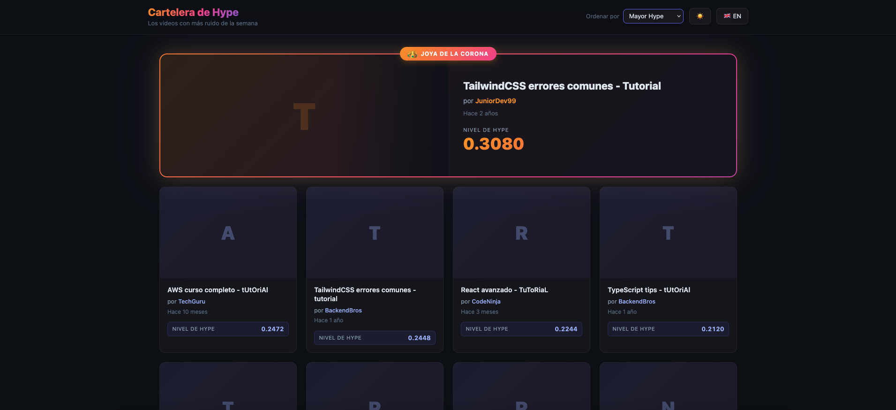

# Hype Billboard

> [!NOTE]
> Prefer to read this in English? [View English README](README.md)

> Una cartelera de videos tecnológicos que filtra el ruido. El backend actúa como un colador inteligente sobre datos crudos de YouTube — calcula un **Nivel de Hype** para cada video y destaca la **Joya de la Corona** (el de mayor hype) en la interfaz.



## Stack

| Capa | Tecnología |
|---|---|
| Backend | NestJS · TypeScript · class-validator · Swagger |
| Frontend | React · Vite · TypeScript · react-i18next |
| DevOps | Docker · Docker Compose |
| Testing | Jest (backend) · Vitest + RTL (frontend) |

---

## Inicio rápido con Docker (recomendado)

> Requiere Docker y Docker Compose instalados.

```bash
docker-compose up --build
```

| Servicio | URL |
|---|---|
| Frontend | http://localhost:80 |
| API Backend | http://localhost:3000/api/videos |
| Documentación Swagger | http://localhost:3000/api/docs |
| Health check | http://localhost:3000/health |

---

## Instalación manual

### Backend

```bash
cd backend
cp .env.example .env
npm install
npm run start:dev
```

Backend disponible en **http://localhost:3000**

### Frontend

```bash
cd frontend
cp .env.example .env
npm install
npm run dev
```

Frontend disponible en **http://localhost:5173**

---

## Referencia de la API

### `GET /api/videos`

Devuelve la lista de videos con hype calculado y limpiada de datos innecesarios.

| Parámetro | Tipo | Por defecto | Descripción |
|---|---|---|---|
| `sort` | `hype` \| `date` | `hype` | Criterio de ordenamiento |
| `limit` | `1–50` | — | Máximo de resultados |
| `lang` | `es` \| `en` | `es` | Idioma de las fechas relativas |

**Ejemplo de respuesta:**
```json
{
  "data": [
    {
      "id": "vid_003",
      "title": "TailwindCSS errores comunes - Tutorial",
      "author": "JuniorDev99",
      "thumbnail": "https://...",
      "publishedAt": "Hace 2 años",
      "hypeLevel": 0.3079,
      "isCrown": true
    }
  ],
  "meta": { "timestamp": "2026-04-22T...", "count": 50 },
  "status": "success"
}
```

### `GET /health`

```json
{ "data": { "status": "ok", "uptime": 42.3 }, "status": "success" }
```

---

## Ejecutar tests

### Backend (unitarios + e2e)

```bash
cd backend
npm run test        # tests unitarios
npm run test:e2e    # tests end-to-end
npm run test:cov    # reporte de cobertura
```

### Frontend

```bash
cd frontend
npm run test        # modo watch
npm run test:run    # ejecución única
```

---

## Fórmula del Nivel de Hype

```
nivelHype = (likes + comentarios) / vistas
```

**Modificadores:**
- El título contiene `tutorial` (sin importar mayúsculas) → `nivelHype × 2`
- El campo `commentCount` está ausente → `nivelHype = 0`
- `viewCount = 0` → `nivelHype = 0` (evita división por cero)
